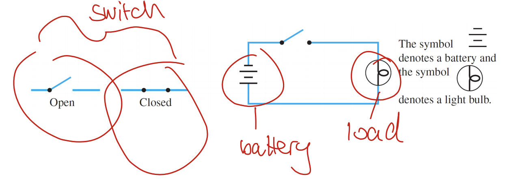
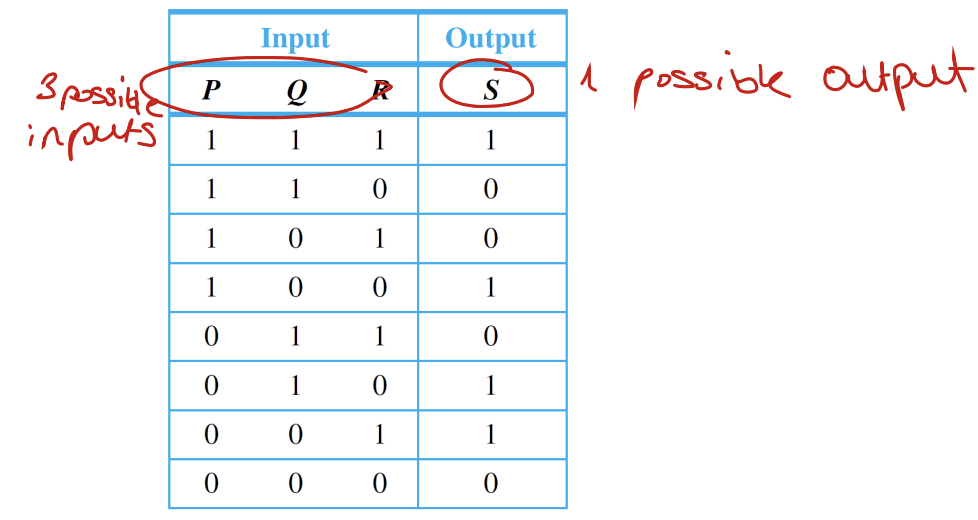
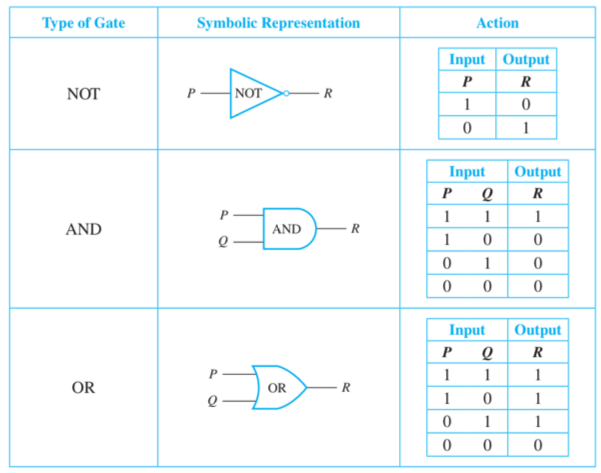
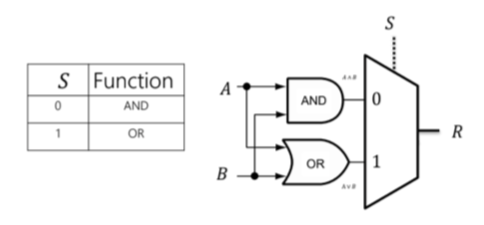
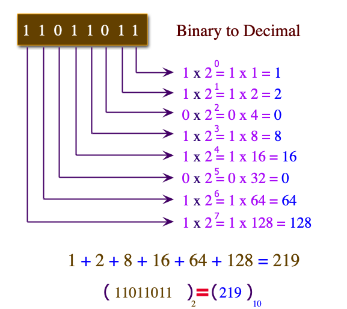
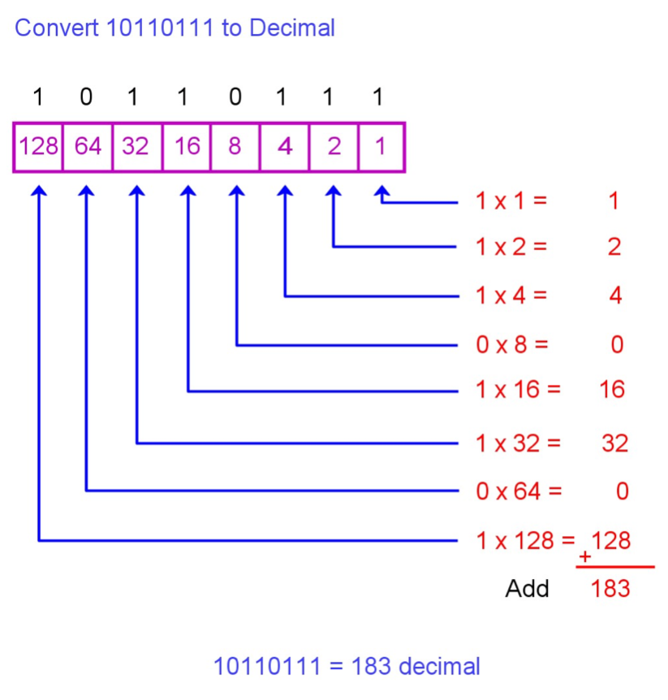

# Digital logic circuits

## Simple circuit

{ width=350px }

A simple circuit has three elements: switch, battery and load

{ width=350px }

Switches can either be used "in series" (the circuit will only work when both switches are closed) or "in parallel" (the circuit will work when one of the both switches are closed). 

The in series circuit is equivalent to the AND truth table, where closed is equivalent to true and the truth table is only true when both values are true (closed).

The in parallel circuit is equivalent to the OR truth table, where closed is equivalent to true and the truth table is only false when both values are false (open). 

\newpage

## Combinatorial circuit

- cominatorial: type of digital circuit whose output only depends on the current input.
- sequential: output depends on both the current input and previous outputs. This means a sequential circuit
preserves a memory of the input while a combinational circuit does not (out of scope for this course)

{ width=350px }

Rules for cominatorial circuits

1. Never combine the input wires.
2. Never feed back the output of a gate into the same gate

- combinatorial equivalence: two circuits can have the same output but built completely differently
- circuit minimization: for production of electrical circuit it makes sense minimizing more complicated circuits to simplified ones so that they cost lesser in production.

## Logic gates

{ width=450px }

## Disjunctive Normal Form (DNF)

Also called "Or of And's" $$ G(p,q) \equiv (p \land q) \lor (\neg p \land q) $$

## Conjunctive Normal Form (CNF)

Also called "And of Or's" $$ G(p,q) \equiv (p \lor q) \land (\neg p \lor q) $$

\newpage

## Multiplexer

This Multiplexer selects the output of the AND operation if the selector S=0, otherwise it selects the output of the OR operation.

{ width=350px }

## Binary to decimal

For the binary number, read the numbers from bottom to top.

{ width=350px }

\newpage

## Decimal to binary

Multiply each digit with it's binary equivalent.

{ width=350px }

## Half-Adder

## Full-Adder