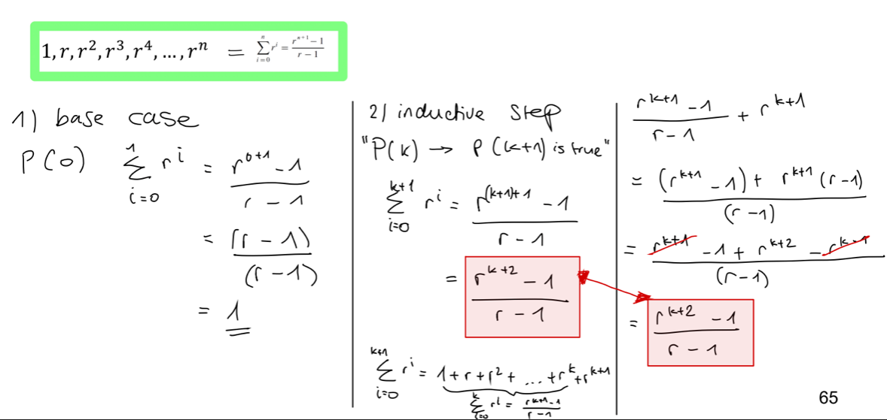

# Sequences

A sequence is a function whose domain is either all the intergers between two given intergers or all the integers greater than or equal to a given integer. The equence is typically represented as a set of elements written in a row $a_{m}, a_{m+1}, a_{m+2},..., a_{n}$, where each individual element $a_{k}$ is called a term. The $k$ is called subscript or index.

## Geometric sequence

A Sequence is only called an geometric sequence if and if only there is a constant $r$ such that

$a_{k} = a_{k-1} * r$

  


## Arithmetic sequence

A Sequence is only called an arithmetic sequence if and if only there is a constant $d$ such that

$a_{k} = a_{k-1} + d$


# Mathematical induction

4 step plan for solving induction problems:

1. Identify base case
2. Set up induction hypothesis
3. Prove hypothesis (if true) with induction step
4. Conclude

## Example: Sum of first n integers

$1 + 2 + ... + n = \frac{n(n+1)}{2}$ for all integers $n \geq 1$

Base case: $P(1) = \frac{1(1+1)}{2}$ = $\frac{2}{2} = 1$

Inductive hypothesis: "$P(k) = \frac{k(k+1)}{2}$ is true"

Inductive step: $P(k+1) = \frac{k+1((k+1)+1)}{2} = \frac{(k+1)(k+2)}{2}$

$\frac{(k+1)(k+2)}{2}$ is of the same form as $\frac{n(n+1)}{2}$ $\rightarrow (k+1) = n$

## Example: The triomino problem

See this [link](https://nstarr.people.amherst.edu/trom/puzzle-8by8/) for more 

## Example: The towers of Hanoi

See this [link](https://www.youtube.com/watch?v=q6RicK1FCUs) for more

# Strong mathematical induction

- Base case: Show that $P(a) \land P(a+1) \land ... \land P(b) \land ... \land P(k)$ is true
- Inductive step
  - Hypothesis: Assume base case is true
  - Show that $P(k+1)$ is true
- Conclusion if base case and inductive hypothesis is true for all $n\geq a$

## Example: Prime factorization theorem

See this [link](https://courses.cs.cornell.edu/cs2800/wiki/index.php/Proof:Every_natural_number_has_a_prime_factorization_(strengthened_induction_hypothesis)) for more

# Recursive functions

A recursive function is recursive when its defintion refers to itself. It is made of a base case and one or multiple recursive calls. The recursive functions are easier to implement for complex problems. It's more elegant and easier to understand, short and concise. But it is more expensive in regards of time and memeory. Unnecessary calls do double check on for / if / while loops.

## Example: Factorial function

```C
int factorial (int n) 
{
    if (n=0)
        return 1;
    else
        return n * factorial(n-1)
}
```

The function referes to itself, calling itself as long as n is not equal to 0.

## Example: GCD (Greatest Common Divisor)

The GCD is one of the most used algorithms in Computer Science, mostly in the field of cryptography.

$$ gcd (72,63) -> 72 = 3^2 * 2^3, 63 = 3^2 * 7$$

Both elements have a $3^2$, which means $gcd(72,63) = 3^2 = 9$

## Example: The Euclidian Algorithm

```C
int gcd (int A, int B)
{
    if (B=0)
        return A;
    else return gcd(B, A mod B)
}
```

# Algorithmic correctness

- Base property: P(0) is true
- Inductive property: $Guard$ and loop invariant $P(k)$
- Eventual Falsity of the Guard: after finite number of repetitions, $G$ becomes false.
- Correctness of post-condition.: if $N$ is at least to, which makes $G$ becomes false