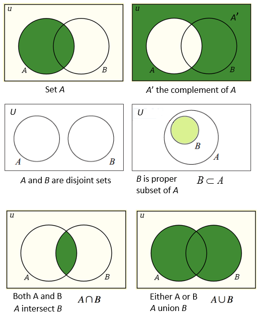
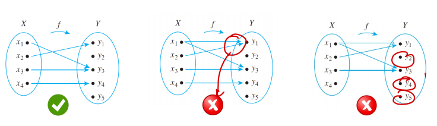
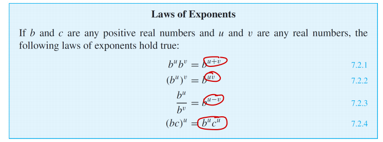
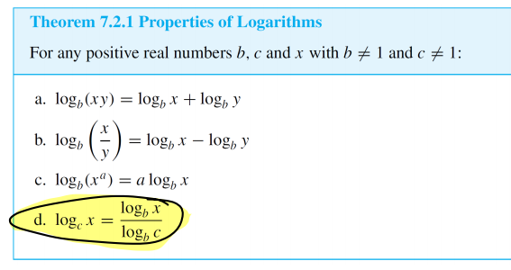

## Set Theory

### Cantor's defintion of a set

A set is a collection of definite and seperate objects. These objects are called elements of the set.

An empty set is denoted by { }, it is an unique set with no elements.

### Ordered tuples

An ordered n-tuple is defined by $(x_1,x_2,...,x_n)$

An ordered pair is defined by $(x_1,x_2)$

An ordered triple is defined by $(x_1,x_2,x_3)$

Rule: $(a,b) = (c,d)$ iff (in and only if) $(a=c), (b = d)$

### Cartesian products

The Cartesian product $A_1 \times A_2 \times ... \times A_n$ of ordered n-tuples ${(a_1,a_2,...,a_n) | (a_1\in A_1) \wedge (a_2\in A_2) \wedge ... \wedge (a_n\in A_n)}$

## Functions

A function is built from two sets, $X$ and $Y$. What the function does is build a relation between these two sets following these two rules: 

- Every element of $X$ is related to some elements in $Y$
- No element of $X$ is related to more than one element in $Y$

Following cases are also allowed:

- There can be elements of the co-domain $Y$ that are not function of any input element.
- Different inputs can mapped to the same element of $Y$.

  

### Notable functions

- The identity function: $I: X \rightarrow X$, where each element is mapped to itself.
- The exponential function
- The log-function
- The Hamming-Distance Function
- The image function

#### Exponential rules

#### Logarithmic rules

## Convolution

- Check slides for explaination
- See this [link](https://phiresky.github.io/convolution-demo/) for a demo