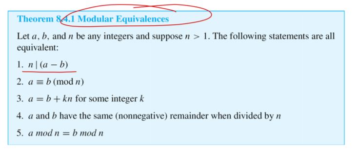
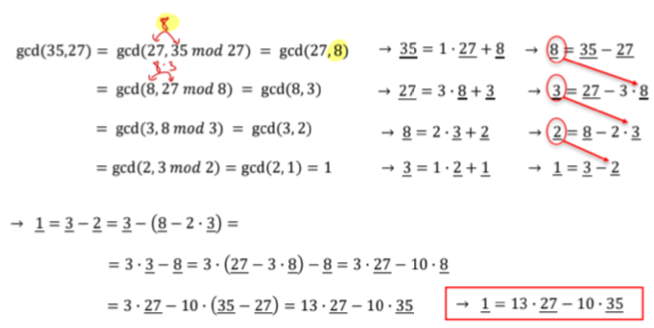

# Relations

Relations are more general than functions. The key difference is that the same element in the Domain may be related to multiple elements in the Co-domain

## Inverse of a Relation

$𝐑^{-1} = { (y,x) \in B\times A | (x,y) \in R }.$

For all $x \in A$ and $y \in B$, $(y,x) \in R_{-1}\iff (x,y) \in R$.

What this means is visualized in the following diagram:

{ width=450px }

In this case, the second diagram is an inverse of the first.

## Finite sets and directed graphs

A directed graph displays the relations inside a finite set. What we see is that from $A = {2, 3, 4, 6, 7, 9}$ -  we created the three sets $(4, 7)(2)(3,6,9)$

{ width=450px }

## Equivalence relations

An equivalence relation is only one if the three following conditions are fulfilled:

### Reflexivity

R is reflexive if, and only if, for all $x \in A, x R x$.

What this means, is that x is related to itself. In a directed graph, this would be an arrow from a number showing back to the same number. 

### Symmetry

R is symmetric if, and only if, for all $x,y \in A,$ if $xRy$ then $yRx$.

What this means, is that two elements are related to each other symmetrically. In a directed graph, these two numbers are connected by two arrows pointing at each other.

### Transitivity

R is transitive if, and only if, for all $x,y,z \in A$, if $xRy$ amd $yRz$ then $xRz$.

What this means, when we have three elements $x, y, z$, $x$ is related to $y$ and $y$ is related to $z$ which means that $x$ is also related to $z$. In directed graph, we would have 3 elements in a triangular form all pointing at each other.

## Example: Equivalence relation

From $A = 4, 5, 6, 7, 8, 10$ we arrived to the relation
$$R = (4,4), (4, 10), (10, 4), (10, 10), (6, 6), (5, 5), (7, 7), 
(8, 8), (5, 8), (8, 7), (7, 5)$$

Here we can also see the three conditions clearly.

- Reflexivity: $(4,4), (10, 10), (6, 6), (5, 5), (7, 7), (8, 8)$
- Symmetry: $(4, 10), (10, 4)$
- Transitivity: $(5, 8), (8, 7), (7, 5)$

{width=450px}

# Congruences

Let m and n be integers and let d be a postiive integer. We say that m is congruent to n modulo d and write

$m ≡ n$ (mod d)

if an only if, $d | (m-n)$

## Examples

- $12 ≡ 7\ (mod\ 5)$ -> $5 \vert (12-7) = 5$ -> $5 \vert 5$ -> true
- $6 ≡ -8\ (mod\ 4)$ -> $4 \vert (6-(-8)) = 14$ -> $4 \vert 14$ -> false
- $3 ≡ 3\ (mod\ 7)$ -> $ 3 \vert (3-3) = 0$ -> $7 \vert 3$ -> true

# Modular arithmetic

{width=450px}

## Inverse modulo n

The modular inverse of an integer a is an integer x such that: $a ⋅ b ≡ 1 (mod \\ n) $

Example: Inverse of 3 modulo 7

- $3 ⋅ 0 ≡ 0 (mod \\ 7) $
- $3 ⋅ 1 ≡ 3 (mod \\ 7) $
- $3 ⋅ 2 ≡ 6 (mod \\ 7) $
- $3 ⋅ 3 ≡ 2 (mod \\ 7) $
- $3 ⋅  4 ≡  5  ( m  o  d \\  7) $
- $\textbf 3 ⋅ \textbf 5 ≡ \textbf 1 \textbf (\textbf m \textbf o \textbf d \\ \textbf 7) $
- $3 ⋅ 6 ≡ 4 (mod \\ 7) $

## Bezout's theorem and Euclidian Algorithm

$gcd(a,b) = \textbf sa + \textbf tb$

  

## Example: Ceasar cipher

An encryption system which uses the 26 letters of the alphabet but just by pushing them some places forward.

Example: $A = D$ because our steps we are using is 3, which would mean $B=E$, $C=F$ etc.

Formula for encryption: $C = (M+3) \\ mod \\ 26 $

Formula for decryption: $C = (M-3) \\ mod \\ 26 $

Very easy to hack once the factor is known. 

## RSA cryptography

In RSA, the plaintext M is converted into ciphertext C according to the following formula:

$C = M^{e}$ $mod$ $pq$

$pq$ and $e$ are the public keys and anyone can use them to encrypt their messages!

The plaintext M for a ciphertext C is then recovered as follows:

$M = C^{d}$ $mod$ $pq$. Where d is the private key; it is secret and only the recipient knows it.

### When does the RSA Cipher work?

For the RSA to work, the following expression must all for all positive integers M < pq: $M = (M^{e})^{d}$ $mod$ $pq$

This holds if:

- $p$ and $q$ are prime
- $e$ and the product $(p − 1)(q − 1)$ are relatively prime (e.g., their greatest common divisor is 1)
- $ed ≡ 1$ (mod(p−1)(q−1)).
  - (i.e., $d$ is the inverse of e modulo $(p − 1)(𝑞 − 1)$).