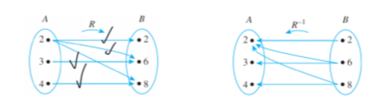
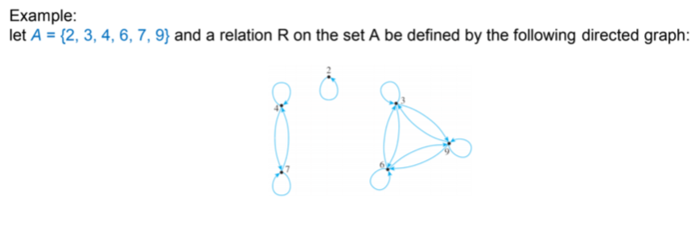
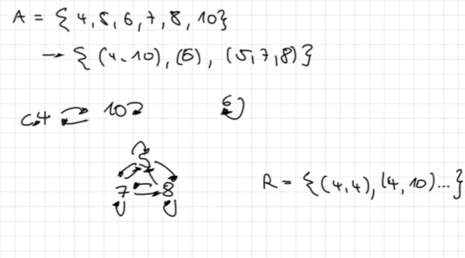

# Relations

Relations are more general than functions. The key difference is that the same element in the Domain may be related to multiple elements in the Co-domain

## Inverse of a Relation

$𝐑^{-1} = { (y,x) \in B\times A | (x,y) \in R }.$

For all $x \in A$ and $y \in B$, $(y,x) \in R_{-1}\iff (x,y) \in R$.

What this means is visualized in the following diagram:

{ width=450px }

In this case, the second diagram is an inverse of the first.

## Finite sets and directed graphs

A directed graph displays the relations inside a finite set. What we see is that from $A = {2, 3, 4, 6, 7, 9}$ -  we created the three sets $(4, 7)(2)(3,6,9)$

{ width=450px }

## Equivalence relations

An equivalence relation is only one if the three following conditions are fulfilled:

### Reflexivity

R is reflexive if, and only if, for all $x \in A, x R x$.

What this means, is that x is related to itself. In a directed graph, this would be an arrow from a number showing back to the same number. 

### Symmetry

R is symmetric if, and only if, for all $x,y \in A,$ if $xRy$ then $yRx$.

What this means, is that two elements are related to each other symmetrically. In a directed graph, these two numbers are connected by two arrows pointing at each other.

### Transitivity

R is transitive if, and only if, for all $x,y,z \in A$, if $xRy$ amd $yRz$ then $xRz$.

What this means, when we have three elements $x, y, z$, $x$ is related to $y$ and $y$ is related to $z$ which means that $x$ is also related to $z$. In directed graph, we would have 3 elements in a triangular form all pointing at each other.

## Example: Equivalence relation

From $A = 4, 5, 6, 7, 8, 10$ we arrived to the relation $R$ = $(4,4), (4, 10), (10, 4), (10, 10), (6, 6), (5, 5), (7, 7), (8, 8), (5, 8), (8, 7), (7, 5)$

Here we can also see the three conditions clearly.

- Reflexivity: $(4,4), (10, 10), (6, 6), (5, 5), (7, 7), (8, 8)$
- Symmetry: $(4, 10), (10, 4)$
- Transitivity: $(5, 8), (8, 7), (7, 5)$

{width=450px}

# Congruences

# Modular arithmetic

## Inverse modulo n

## Bezout's theorem

## Example: Ceasar cipher

## RSA cryptography