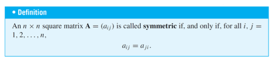

# Graphs

Graphs are a powerful problem-solving tool because they enable us to represent a complex situation with a single image that can be analyzed both visually and with the aid of a computer

## Terminology of graphs

- Graph: The whole drawing
- Parallell edges: 2 edges connecting to each other
- Isolated vertex: No edges connected
- Adjaceny: 2 connected edges
- Degree: Number of edges that start or end at a vertex

{ width=350px}

{ width=350px}

## Sub-graphs

The left graph has 11 sub-graphs

{ width=350px}

## Matrices and directed graphs

Show connections from vertices to other vertices in form of a matrix

{ width=350px}

## Matrices and undirected graphs

Note that an adjacency matrix of an undirected graph is symmetric.

{ width=350px}

## Matrices and connected components

{ width=350px}

The adjacency matrix of this graph is a block-diagonal matrix: it consists of square matrix blocks for each connected component, along the diagonal, and blocks of 0’s everywhere else. The reason is that vertices in each connected component share no edges with vertices in other components.

## Isomorphisms of graphs

Two graphs that are the same except for the labeling of their vertices and edges are called isomorphic

{ width=350px}

The first two graphs are identical althought their topology is different: their vertex and edge sets are identical and their edge-endpoint functions are the same.

# Trails

Trails are routes that do not have a repeated edge.

{ width=350px}

Not a trail: 

{ width=350px}  

# Paths

Paths are trails that do not have repeated vertices

Without the loop on $v_3$ this would be a path

{ width=350px}

# Circuits

Circuits are trails that start and end at the same vertex

{ width=350px}  

## Simple circuits

Simple circuits are circuits that only pass through each vertex of the circuit only once, except for the start and end vertices

{ width=350px}  

## Euler cicuits

An Euler circuit passes through all the vertices of G at least once and passes through all the edges only once.

{ width=350px}

A graph has an Euler circuit if, and only if, the graph is connected and every vertex of the graph has even degree (because the total number of arrivals and departures from each vertex must be a multiple of 2).

## Hamiltonian circuits

A Hamiltonian circuit for a graph G is a circuit that passes through all the vertices of G only once (except for the start and end vertices). Since it is a circuit, it has no repeated edges.

A Hamiltonian circuit is a simple circuit that passes through all vertices of G (remember that, according to the definition, a simple circuit does not need to pass through all vertices of G).

## Example: Travelling salesman problem

Suppose we had a complete graph with 4 cities, like the example before.

1. From A there are 3 cities we can visit first (B, C, D).
2. From each of those, there are 2 possible cities to visit.
3. And, from each of those, there is then only 1 choice before returning home.

Total 6 routes, but 3 of them are duplicates. So 3 unique routes. Formula $\frac{(n-1)!}{2}$ for n cities.

{ width=350px}

At present, there is no efficient and optimal algorithm to solve the Travelling Salesman Problem (TSP).

# Trees

A tree is a connected graph that does not contain any circuits. A tree with $n$ vertices has $n-1$ edges.

{ width=350px}  

## Rooted trees

- Rooted trees (Example d in screenshot above) 
- Unique path from root to leaf
- Leveled
- Height = maximal level

## Binary trees

- Each vertex has at most two children
- When each internal vertex has exactly two children, it is called full binary tree

## Octrees

- Each vertex has exactly 8 children 
- Used in 3D graphics

## Spanning trees

{ width=350px}  

- A spanning tree for a graph is a tree that contains every vertex of the graph.
- Every connected graph has a spanning tree.
- Any two spanning trees for a graph have the same number of edges.

### Minimum spanning trees

A graph whose edges are labeled with numbers (weights) is called a weighted graph.

A minimum spanning tree, is a spanning tree for which the sum of the weights of all the edges is as small as possible.

Problem:

{ width=350px}  

Solution: 

{ width=350px}

# Kruksal's Algorithm

1. Mark the edge with minimum weight and mark its connected vertices as visited.
2. Add the next unmarked edge with minimum weight only if its addition does not generate a circuit. Mark its connected vertices as visited.
3. Repeat from 2 until all vertices have been visited.

# Prim's Algorithm

1. Pick an arbitrary vertex.
2. Mark the edge connected to it that has minimum weight and mark its connected vertex as visited.
3. Check all vertices visited so far which still “see” unvisited vertices and mark the one adjacent edge with minimum weight and mark its connected vertex as visited.
4. Repeat from 3 until all vertices have been visited.

# Dijkstra's Algorithm

Main idea:

1. Define the start vertex S (this is usually given)

2.  Assign to all its adjacent vertices the cost to reach them from S and to allnon-adjacent vertices an infinite cost. 

3.  Check all vertices visited so far which still “see” unvisited vertices, then visit the vertex with minimum cost and update the cost of all its adjacent vertices with the total cost to reach them from S passing through the current vertex.

4.  Repeat from 3 until all vertices have been visited